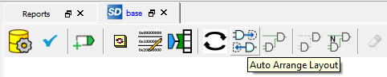
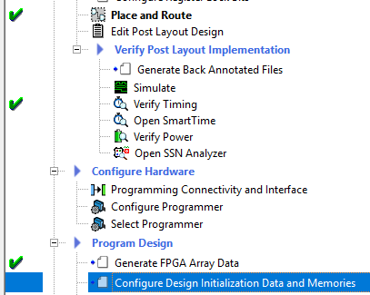
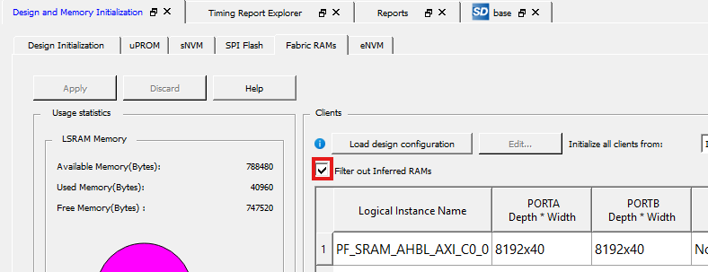
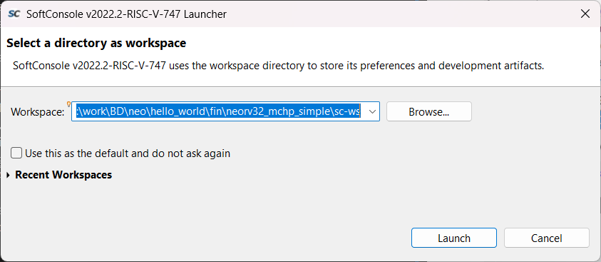
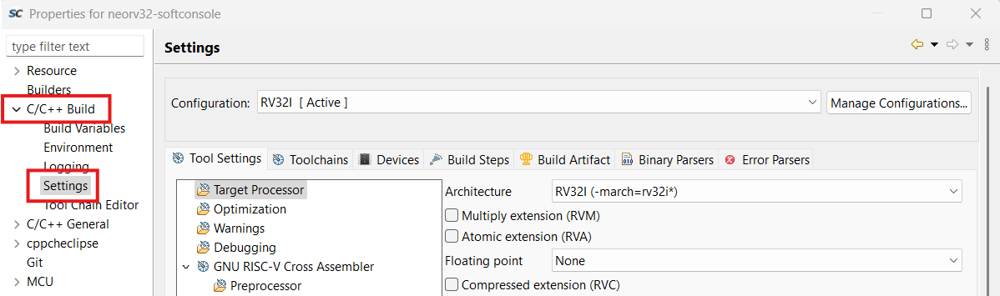
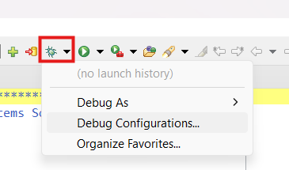
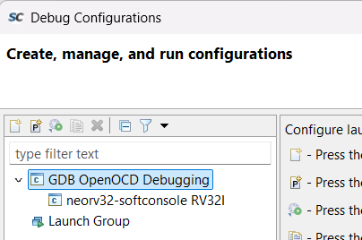
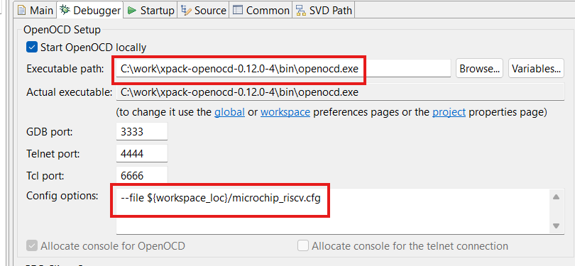
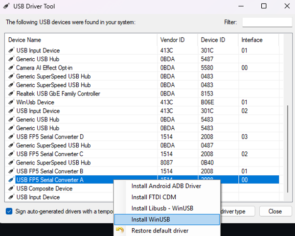
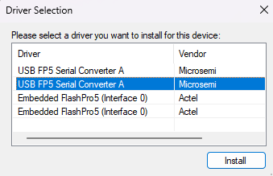

# NeoRV32 Hello World On Microchip FPGA

This repository contains a simple design and software application to show the implementation of NeoRV32 in a Microchip FPGA. All tools will use free or no licenses.

Check out the [NeoRV32 GitHub](https://github.com/stnolting/neorv32) for more information.

## Contents

- [Supported Devices](#supported-devices)
- [Structure](#structure)
  - [FPGA Design](#fpga-design)
  - [Embedded Software](#embedded-software)
- [Running Hello World](#running-hello-world)
  - [Tools Required](#tools-required)
  - [Generating the FPGA Design](#generating-the-fpga-design)
  - [Building an Application in SoftConsole](#building-an-application-in-softconsole)
  - [Debugging an Application](#debugging-an-application)
- [Benchmarks](#benchmarks)

## Supported Devices

The design generated via this repository targets the [PolarFire SoC Discovery Kit](https://www.microchip.com/en-us/development-tool/mpfs-disco-kit) but any IGLOO&reg;2, SmartFusion&reg;2, PolarFire&reg; or PolarFire&reg; SoC device should be supported.

## Structure

This workspace contains several files and directories used to generate an FPGA design and embedded software project for NeoRV32. An "images" directory stores all images for this readme.

### FPGA Design

The FPGA design files consist of:

- neorv32_mchp_simple.tcl: this is the main Tcl script to generate a Libero project.
- script: a directory containing exported Tcl scripts used in the design flow.
- neorv32: a submodule of the NeoRV32 repository.

### Embedded Software

The embedded software consists of:

- sc-ws: a SoftConsole project workspace.

## Running Hello World

This section will outline the tool set up, tool flow and steps to run the hello world project with NeoRV32.

### Tools Required

To generate the FPGA design Libero SoC and a license will be required.

- Libero SoC can be downloaded [here](https://www.microchip.com/en-us/products/fpgas-and-plds/fpga-and-soc-design-tools/fpga/libero-software-later-versions), these scripts have been tested with 2025.1.
- A Libero SoC free silver license can be obtained [here](https://www.microchipdirect.com/fpga-software-products).
  - For more information see the [Libero SoC License Installation Guide](https://ww1.microchip.com/downloads/aemDocuments/documents/FPGA/swdocs/libero/Libero_Installation_Licensing_Setup_User_Guide_2025_1.pdf).

To generate embedded software using the included workspace SoftConsole and OpenOCD will be required.

- SoftConsole is available [here](https://www.microchip.com/en-us/products/fpgas-and-plds/fpga-and-soc-design-tools/soc-fpga/softconsole).

**_NOTE:_** SoftConsole does include OpenOCD but this version does not support the NeoRV32 debugger, a newer OpenOCD release will be required to use NeoRV32.

- OpenOCD with NeoRV32 support is available [here](https://github.com/microchip-fpga/openocd/releases/tag/v0.12.0-mchp.0.0.1).
  - On Windows [USB Driver Tool](https://visualgdb.com/UsbDriverTool/) will also be required.

### Generating the FPGA Design

To generate the FPGA design ensure you have Libero installed with a valid license.

1. Clone this repository and ensure submodules have been initialized.

    ```bash
    git clone https://github.com/hughbreslin/neorv32_mchp_simple.git
    git submodule init
    git submodule update
    ```

2. Launch Libero SoC.

3. Open the run script dialog (CTRL + U) and run the `neorv32_mchp_simple.tcl` script from this directory.


**_NOTE:_** default I/O constraints for UART0 and PWM[6:0] are automatically imported.

**_NOTE:_** default clock constraints for JTAG / system clocks are imported or derived.

4. At this stage NeoRV32 can be configured as required by double clicking on the `neorv32_libero_ip_0` component.

**_NOTE:_** Libero only supports integer or natural types in configurators, for this reason all boolean parameters are converted to ints in the wrapper file.

5. If you are going to debug the CPU to download an application you can just generate a bitstream and program your Discovery Kit, if you would like to include an application in the bitstream continue with the steps below.

**_NOTE:_** it is easier to view the SmartDesign if the "Auto Arrange Layout" option is run.



6. Run the design flow to the "Generate FPGA Array Data", it is also recommended to run the "Verify Timing" stage of the design flow.

7. Separately build your application image and export a `.hex` file. This is demonstrated in the [Building an Application in SoftConsole](#building-an-application-in-softconsole) section.

8. Run the "Configure Design Initialization Data and Memories" tool in the Libero design flow.



9. In the "Fabric RAMs" tab select the "Filter out Inferred RAMs" option.



10. Double click on the "PF_SRAM_AHBL_AXI_C0_0".

11. In the configurator use the "Content from file" option to point to your `.hex` file.

12. Select "Run PROGRAM Action" from the design flow.

### Building an Application in SoftConsole

This repository includes a SoftConsole workspace with a pre-configured sample application.

1. Open SoftConsole and in the launcher point to the "sc-ws" directory in this repository.



2. The application `main` is in the `neorv32/src/application/main.c` directory.

3. This build is configured for RV32I as a build, this can be changed from the project properties, right click on the project folder and select "Properties".



4. The project can be built using `CTRL + B`.

5. Once built the `RV32I/neorv32-softconsole.hex` file can be used with Libero.

#### Debugging an Application

To debug a NeoRV32 core a newer OpenOCD version to the standard version bundled with SoftConsole needs to be used and can be downloaded [here](https://github.com/microchip-fpga/openocd/releases/tag/v0.12.0-mchp.0.0.1) - this is the same link that was provided previously.

1. Download and extract the OpenOCD v0.12.0-3 release for your machine.

2. Open the SoftConsole debug configurations.



3. Double click on "GDB OpenOCD Debugging" to create a new debug configuration.



4. In the "Debugger" tab update the "Executable path" to point to the OpenOCD that was downloaded previously and update the "Config options" to

    --file ${workspace_loc}/microchip_riscv.cfg



5. On Windows:
  - launch "USB Driver Tool".
  - Locate "USB FP5 Serial Converter A", right click and select "Install WinUSB".



  - **_NOTE:_** this step should be reverted and the default "USB FP5 Serial Convertor A" driver restored to program the FPGA.



6. In SoftConsole click apply the settings and select "Debug".


## Benchmarks

The following table contains benchmarks of the NeoRV32 in different configurations using this design:

| RV Extensions | Peripherals                | CLK    | 4LUT | DFF  | uSRAM | LSRAM | MACC | Logic Elements<br>(4LUT + DFF) | Coremark |
|---------------|----------------------------|--------|------|------|-------|-------|------|-----------------------------|----------|
| RV32IC        | - Debug<br>- UART x1<br>- PWM x7 | 200MHz | 3340 | 2017 | 10    | 0     | 0    | 5357                        | TBD      |
