# NeoRV32 Hello World On Microchip FPGA

This repository contains a simple design and software application to show the implementation of NeoRV32 in a Microchip FPGA. All tools will use free or no licenses.

Check out the [NeoRV32 GitHub](https://github.com/stnolting/neorv32) for more information.

## Contents

- [Supported Devices](#supported-devices)
- [Structure](#structure)
  - [FPGA Design](#fpga-design)
  - [Embedded Software](#embedded-software)
- [Running Hello World](#running-hello-world)
  - [Tools Required](#tools-required)
  - [Generating the FPGA Design](#generating-the-fpga-design)
  - [Integrating NeoRV32 into a Custom Design](#integrating-neorv32-into-a-custom-design)
  - [Building an Application in SoftConsole](#building-an-application-in-softconsole)
  - [Debugging an Application](#debugging-an-application)
- [Benchmarks](#benchmarks)
  - [Benchmark Results Summary](#benchmark-results-summary)
    - [C Extension](#c-extension)
    - [M Extension](#m-extension)
    - [Fast Shifter](#fast-shifter)
    - [Cache](#cache)
    - [Execution Memory](#execution-memory)

## Supported Devices

The design generated via this repository targets the [PolarFire SoC Discovery Kit](https://www.microchip.com/en-us/development-tool/mpfs-disco-kit) but any IGLOO&reg;2, SmartFusion&reg;2, PolarFire&reg; or PolarFire&reg; SoC device should be supported.

## Structure

This workspace contains several files and directories used to generate an FPGA design and embedded software project for NeoRV32. An "images" directory stores all images for this readme.

### FPGA Design

The FPGA design files consist of:

- neorv32_mchp_simple.tcl: this is the main Tcl script to generate a Libero project.
- script: a directory containing exported Tcl scripts used in the design flow.
- neorv32: a submodule of the NeoRV32 repository.

### Embedded Software

The embedded software consists of:

- sc-ws: a SoftConsole project workspace.

## Running Hello World

This section will outline the tool set up, tool flow and steps to run the hello world project with NeoRV32.

### Tools Required

To generate the FPGA design Libero SoC and a license will be required.

- Libero SoC can be downloaded [here](https://www.microchip.com/en-us/products/fpgas-and-plds/fpga-and-soc-design-tools/fpga/libero-software-later-versions), these scripts have been tested with 2025.1.
- A Libero SoC free silver license can be obtained [here](https://www.microchipdirect.com/fpga-software-products).
  - For more information see the [Libero SoC License Installation Guide](https://ww1.microchip.com/downloads/aemDocuments/documents/FPGA/swdocs/libero/Libero_Installation_Licensing_Setup_User_Guide_2025_1.pdf).

To generate embedded software using the included workspace SoftConsole and OpenOCD will be required.

- SoftConsole is available [here](https://www.microchip.com/en-us/products/fpgas-and-plds/fpga-and-soc-design-tools/soc-fpga/softconsole).

**_NOTE:_** SoftConsole does include OpenOCD but this version does not support the NeoRV32 debugger, a newer OpenOCD release will be required to use NeoRV32.

- OpenOCD with NeoRV32 support is available [here](https://github.com/microchip-fpga/openocd/releases/tag/v0.12.0-mchp.0.0.1).
  - On Windows [USB Driver Tool](https://visualgdb.com/UsbDriverTool/) will also be required.

### Generating the FPGA Design

To generate the FPGA design ensure you have Libero installed with a valid license.

1. Clone this repository and ensure submodules have been initialized.

    ```bash
    git clone https://github.com/hughbreslin/neorv32_mchp_simple.git
    cd ./neorv32_mchp_simple
    git submodule init
    git submodule update
    ```

2. Launch Libero SoC.

3. Open the run script dialog (CTRL + U) and run the `neorv32_mchp_simple.tcl` script from this directory.


**_NOTE:_** default I/O constraints for UART0 and PWM[6:0] are automatically imported.

**_NOTE:_** default clock constraints for JTAG / system clocks are imported or derived.

**_NOTE:_** the bootrom component is automatically initialized with a copy of the NeoRV32 bootloader built for RV32I.

**_NOTE:_** it is easier to view the SmartDesign if the "Auto Arrange Layout" option is run.

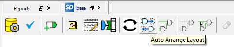


4. At this stage NeoRV32 can be configured as required by double clicking on the `neorv32_libero_ip_0` component.

**_NOTE:_** Libero only supports integer or natural types in configurators, for this reason all boolean parameters are converted to ints in the wrapper file.

5. It is recommended to run the "Verify Timing" stage of the design flow.

6. Select "Run PROGRAM Action" from the design flow.

### Integrating NeoRV32 into a Custom Design

The NeoRV32 source repository contains an [RTL integration script](https://github.com/stnolting/neorv32/blob/main/rtl/system_integration/neorv32_libero_ip.tcl). To use NeoRV32 in your own design:

1. Clone the source repository
2. In Libero run the integration Tcl script
3. The NeoRV32 library should now be availble in your Design Hierarchy

### Building an Application in SoftConsole

This repository includes a SoftConsole workspace with a pre-configured sample application.

1. Open SoftConsole and in the launcher point to the "sc-ws" directory in this repository.

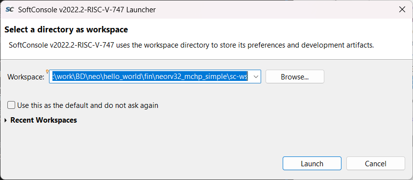

2. This project links to all of the NeoRV32 demo projects available - they are available in `src/demos`

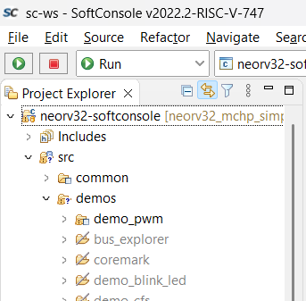

3. By default the PWM example is selected as PWM is enabled in the demo design - you can build the project by using `CTRL + B`.

4. This build is configured for RV32I as a build, this can be changed from the project properties, right click on the project folder and select "Properties".

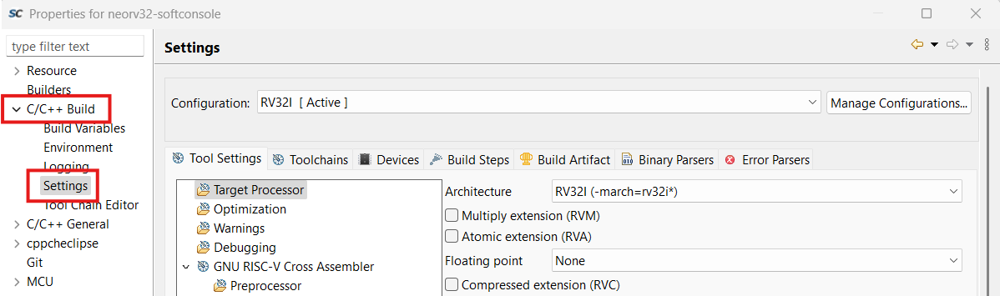

5. The application will be built in `NeoRV32/`.

6. Other demos can be selected by exlcuding the current demo from a build and including the desired demo:

    - Right click on the current demo and open `Resource Configurations -> Exclude from Build`.

    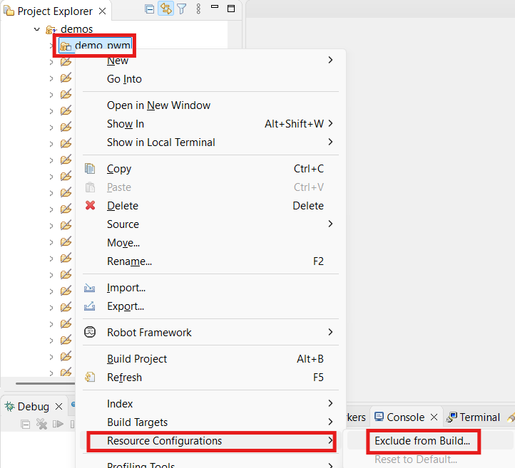

    - Select the "NeoRV32" option.

    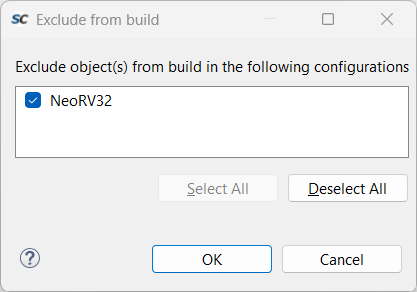

    - Right click on the desired demo and open `Resource Configurations -> Exclude from Build`.

    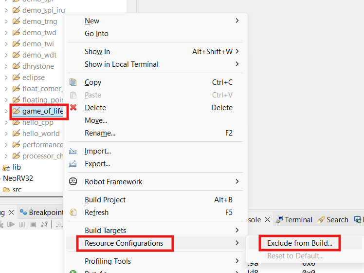

    - Deselect the "NeoRV32" option.

    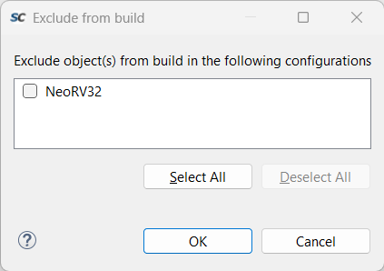

    - Build the project with `CTRL + B`.

#### Debugging an Application

To debug a NeoRV32 core a newer OpenOCD version to the standard version bundled with SoftConsole needs to be used and can be downloaded [here](https://github.com/microchip-fpga/openocd/releases/tag/v0.12.0-mchp.0.0.1) - this is the same link that was provided previously.

1. Download and extract the OpenOCD v0.12.0-3 release for your machine.

2. Open the SoftConsole debug configurations.

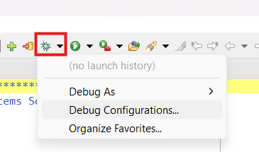

3. Double click on "GDB OpenOCD Debugging" to create a new debug configuration.

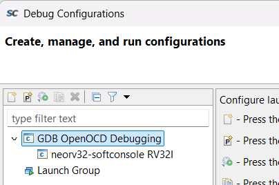

4. If the "Project" entry is unset you can select the project by using the "Broswe" option

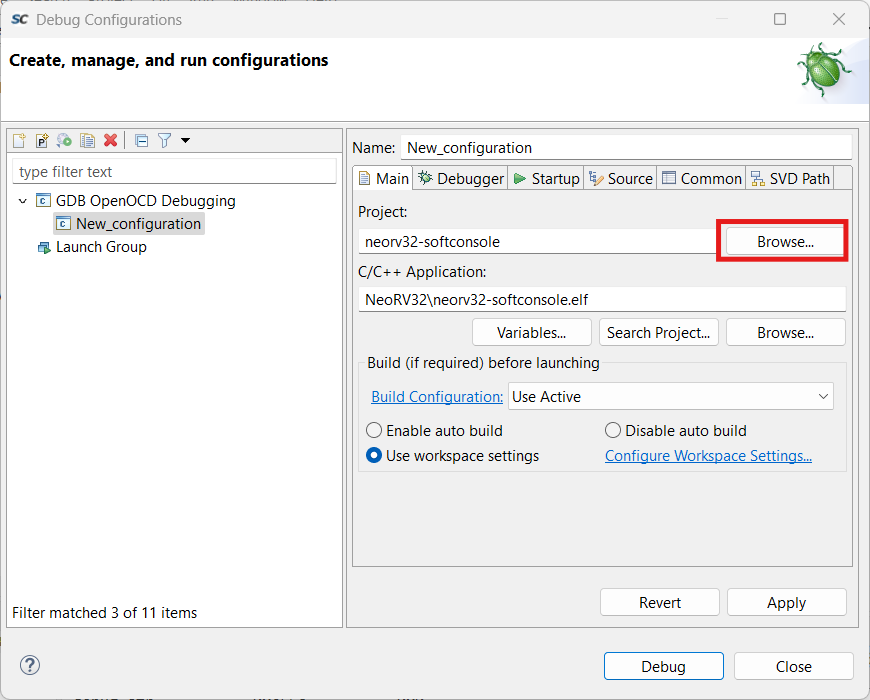

4. In the "Debugger" tab ensure "Start OpenOCD locally" is selected and update the "Executable path" to point to the OpenOCD that was downloaded previously and update the "Config options" to

    --file ${workspace_loc}/microchip_riscv.cfg

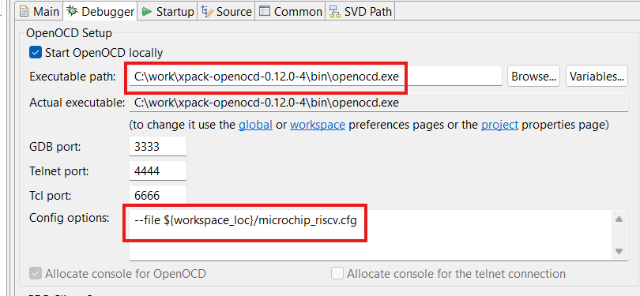

5. On Windows:
  - launch "USB Driver Tool".
  - Locate "USB FP5 Serial Converter A", right click and select "Install WinUSB".

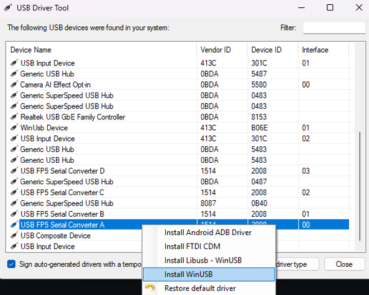

  - **_NOTE:_** this step should be reverted and the default "USB FP5 Serial Convertor A" driver restored to program the FPGA.

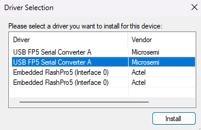

6. In SoftConsole click apply the settings and select "Debug".


## Benchmarks

The following table is a work in progress and attempts to benchmark the NeoRV32 in different configurations showing the FPGA reource utilization and coremark performance.

A summary of these results is available in the next section.

Two main avenues have been taken to benchmark this core:

1. Changing the execution memory

    - Using IMEM and consuming LSRAM internally in the core
    - Using XBUS and using LSRAM, DDR, eNVM etc external to the core

2. Testing different extensions and features in the CPU and SoC with each memory source

    - RV32I -> RV32IMC
    - ICache / DCache / Fast Mul / Fast Shift etc

In each benchmark entry only one configuration area is changed to show the corresponding difference in area and coremark result for the change based on the previous configuration.

The RV32I + UART + XBUS configuration is considdered to be the smallest possible configuration using NeoRV32 which uses 2865 logic elements post synthesis and approximately 2K logic elements post place and route.

For most other configurations the Zicntr and Zihpm extensions, along with the debugger, are enabled to run coremark. This adds an additional 2013 logic elements post synthesis which is approximately 1.3 logic elements post place and route.
  
Resource values are for the core only unless stated otherwise.

| RISC-V Extensions | Execution Memory | Performance Options | Peripherals | CLK | 4LUT | DFF | Core LE total | uSRAM | LSRAM | MACC | LEs after P&R (design) | Coremark | Coremark/MHz | GCC Version | Code Size |
|---|---|---|---|---|---|---|---|---|---|---|---|---|---|---|---|
| RV32I | IMEM | - O3<br> - IMEM_EN<br> - IMEM_SIZE 65536<br> - DMEM_EN<br> - DMEM_SIZE 16384<br> | - Debug<br> - UART x1<br> - PWM x7<br> | 100MHz | Core: 4996<br> Design: 8292 | Core: 3617<br> Design: 5857 | 8613 | 10 | 40 | 0 | 8955 | 32.8 | 0.33 | 8.3.0 | 0xae54 |
| RV32I**C** | IMEM | - O3<br> - IMEM_EN<br> - IMEM_SIZE 65536<br> - DMEM_EN<br> - DMEM_SIZE 16384<br> | - Debug<br> - UART x1<br> - PWM x7<br> | 100MHz | Core: 5199<br> Design: 8495 | Core: 3645<br> Design: 5885 | 8844 | 10 | 40 | 0 | 9114 | 33.3 | 0.33 | 8.3.0 | 0x825c |
| RV32I**M**C | IMEM | - O3<br> - IMEM_EN<br> - IMEM_SIZE 65536<br> - DMEM_EN<br> - DMEM_SIZE 16384<br> | - Debug<br> - UART x1<br> - PWM x7<br> | 100MHz | Core: 5618<br> Design: 8977 | Core: 3813<br> Design: 6053 | 9431 | 10 | 40 | 0 | 9628 | 60.6 | 0.61 | 8.3.0 | 0x7e54 |
| RV32IMC | IMEM | - O3<br> - IMEM_EN<br> - IMEM_SIZE 65536<br> - DMEM_EN<br> - DMEM_SIZE 16384<br> - **ICACHE_EN**<br> - **ICACHE_NUM_BLOCKS 256**<br> - **DCACHE_EN**<br> - **DCACHE_NUM_BLOCKS 256**<br> - **CACHE_BLOCK_SIZE 64**<br> | - Debug<br> - UART x1<br> - PWM x7<br> | 100MHz | Core: 8104<br> Design: 11516 | Core: 5113<br> Design: 7405 | 13217 | 10 | 58 | 0 | 12181 | 58.8 | 0.59 | 8.3.0 | 0x7e54 |
| RV32IMC | IMEM | - O3<br> - **CPU_FAST_MUL_EN**<br> - IMEM_EN<br> - IMEM_SIZE 65536<br> - DMEM_EN<br> - DMEM_SIZE 16384<br> - ICACHE_EN<br> - ICACHE_NUM_BLOCKS 256<br> - DCACHE_EN<br> - DCACHE_NUM_BLOCKS 256<br> - CACHE_BLOCK_SIZE 64<br> | - Debug<br> - UART x1<br> - PWM x7<br> | 100MHz | Core: 8237<br> Design: 11619 | Core: 5107<br> Design: 7399 | 13344 | 10 | 58 | 0 | 12285 | 71.4 | 0.71 | 8.3.0 | 0x7e54 |
| RV32IMC | IMEM | - O3<br> - CPU_FAST_MUL_EN<br> - **CPU_FAST_SHIFT_EN**<br> - IMEM_EN<br> - IMEM_SIZE 65536<br> - DMEM_EN<br> - DMEM_SIZE 16384<br> - ICACHE_EN<br> - ICACHE_NUM_BLOCKS 256<br> - DCACHE_EN<br> - DCACHE_NUM_BLOCKS 256<br> - CACHE_BLOCK_SIZE 64<br> | - Debug<br> - UART x1<br> - PWM x7<br> | 100MHz | Core: 8292<br> Design: 11674 | Core: 5253<br> Design: 7545 | 13545 | 10 | 58 | 4 | 12352 | 90.9 | 0.91 | 8.3.0 | 0x7e54 |
| RV32IMC | IMEM | - O3<br> - CPU_FAST_MUL_EN<br> - CPU_FAST_SHIFT_EN<br> - IMEM_EN<br> - IMEM_SIZE 65536<br> - DMEM_EN<br> - DMEM_SIZE 16384<br> | - Debug<br> - UART x1<br> - PWM x7<br> | 100MHz | Core: 5844<br> Design: 9140 | Core: 3953<br> Design: 6193 | 9797 | 10 | 40 | 4 | 9832 | 90.09 | 0.91 | 8.3.0 | 0x7e54 |
| RV32IMC | IMEM | - O3<br> - CPU_FAST_MUL_EN<br> - CPU_FAST_SHIFT_EN<br> - **CPU_RF_HW_RST_EN**<br> - IMEM_EN<br> - IMEM_SIZE 65536<br> - DMEM_EN<br> - DMEM_SIZE 16384<br> | - Debug<br> - UART x1<br> - PWM x7<br> | 100MHz | Core: 7185<br> Design: 10481 | Core: 4959<br> Design: 7199 | 12144 | 0 | 40 | 4 | 11709 | 90.09 | 0.91 | 8.3.0 | 0x7e54 |
| RV32IMC | XBUS (LSRAM) | - O3<br> - Zicntr<br> - Zihpm<br> - HPM_NUM_CNTS 1<br> - HPM_CNT_WIDTH 40<br> - CPU_FAST_MUL_EN - ICACHE_EN<br> - ICACHE_NUM_BLOCKS **512**<br> - DCACHE_EN<br> - DCACHE_NUM_BLOCKS **512**<br> - CACHE_BLOCK_SIZE 64 | - UART x1<br> - Debug | 100MHz | Core: 8448<br> Design: | Core: 4600<br> Design: | 13048 | 10 | 34 | 4 |  |  |  | 8.3.0 | 0x7e54 |
| RV32IMC | XBUS (LSRAM) | - O3<br> - Zicntr<br> - Zihpm<br> - HPM_NUM_CNTS 1<br> - HPM_CNT_WIDTH 40<br> - CPU_FAST_MUL_EN - ICACHE_EN<br> - ICACHE_NUM_BLOCKS 256<br> - **DCACHE_EN**<br> - **DCACHE_NUM_BLOCKS 256**<br> - CACHE_BLOCK_SIZE 64 | - UART x1<br> - Debug | 100MHz | Core: 6193<br> Design: 20226 | Core: 3514<br> Design: 15071 | 9707 | 10 | 18 | 4 | 20939 | 62.5 | 0.63 | 8.3.0 | 0x7e54 |
| RV32IMC | XBUS (LSRAM) | - O3<br> - Zicntr<br> - Zihpm<br> - HPM_NUM_CNTS 1<br> - HPM_CNT_WIDTH 40<br> - CPU_FAST_MUL_EN - **ICACHE_EN**<br> - **ICACHE_NUM_BLOCKS 256**<br> - **CACHE_BLOCK_SIZE 64** | - UART x1<br> - Debug | 100MHz | Core: 4936<br> Design: 18969 | Core: 2866<br> Design: 14423 | 7802 | 10 | 9 | 4 | 19665 | 44.44 | 0.44 | 8.3.0 | 0x7e54 |
| RV32IMC | XBUS (LSRAM) | - O3<br> - Zicntr<br> - Zihpm<br> - HPM_NUM_CNTS 1<br> - HPM_CNT_WIDTH 40<br> - **CPU_FAST_MUL_EN** | - UART x1<br> - Debug | 100MHz | Core: 3473<br> Design: 17432 | Core: 2214<br> Design: 13580 | 5687 | 10 | 0 | 4 | 18106 | 20.41 | 0.20 | 8.3.0 | 0x7e54 |
| RV32IMC | XBUS (LSRAM) | - O3<br> - Zicntr<br> - Zihpm<br> - HPM_NUM_CNTS 1<br> - HPM_CNT_WIDTH 40<br> - ICACHE_EN<br> - ICACHE_NUM_BLOCKS **512**<br> - DCACHE_EN<br> - DCACHE_NUM_BLOCKS **512**<br> - CACHE_BLOCK_SIZE 64 | - UART x1<br> - Debug | 100MHz | Core: 8416<br> Design: 22449 | Core: 4454<br> Design: 16011 | 12870 | 10 | 34 | 0 | 23104 | 52.63 | 0.53 | 8.3.0 | 0x7e54 |
| RV32IMC | XBUS (LSRAM) | - O3<br> - Zicntr<br> - Zihpm<br> - HPM_NUM_CNTS 1<br> - HPM_CNT_WIDTH 40<br> - ICACHE_EN<br> - ICACHE_NUM_BLOCKS 256<br> - **DCACHE_EN**<br> - **DCACHE_NUM_BLOCKS 256**<br> - CACHE_BLOCK_SIZE 64 | - UART x1<br> - Debug | 100MHz | Core: 6155<br> Design: 20188 | Core: 3368<br> Design: 14925 | 9523 | 10 | 18 | 0 | 20863 | 52.63 | 0.53 | 8.3.0 | 0x7e54 |
| RV32IMC | XBUS (LSRAM) | - O3<br> - Zicntr<br> - Zihpm<br> - HPM_NUM_CNTS 1<br> - HPM_CNT_WIDTH 40<br> - **ICACHE_EN**<br> - **ICACHE_NUM_BLOCKS 256**<br> - **CACHE_BLOCK_SIZE 64** | - UART x1<br> - Debug | 100MHz | Core: 4906<br> Design: 18939 | Core: 2720<br> Design: 14277 | 7626 | 10 | 9 | 0 | 19628 | 39.21 | 0.40 | 8.3.0 | 0x7e54 |
| RV32I**M**C | XBUS (LSRAM) | - O3<br> - Zicntr<br> - Zihpm<br> - HPM_NUM_CNTS 1<br> - HPM_CNT_WIDTH 40<br> | - UART x1<br> - Debug | 100MHz | Core: 5524<br> Design: 17385 | Core: 2068<br> Design: 13484 | 7592 | 10 | 0 | 0 | 18016 | 19.61 | 0.20 | 8.3.0 | 0x7e54 |
| RV32IC | XBUS (LSRAM) | - O3<br> - Zicntr<br> - Zihpm<br> - HPM_NUM_CNTS 1<br> - HPM_CNT_WIDTH 40<br> - ICACHE_EN<br> - ICACHE_NUM_BLOCKS **512**<br> - DCACHE_EN<br> - DCACHE_NUM_BLOCKS **512**<br> - CACHE_BLOCK_SIZE 64 | - UART x1<br> - Debug | 100MHz | Core: 7947<br> Design: 21980 | Core: 4286<br> Design: 15843 | 12233 | 10 | 34 | 0 | 22632 | 30.77 | 0.31 | 8.3.0 | 0x825c |
| RV32IC | XBUS (LSRAM) | - O3<br> - Zicntr<br> - Zihpm<br> - HPM_NUM_CNTS 1<br> - HPM_CNT_WIDTH 40<br> - ICACHE_EN<br> - ICACHE_NUM_BLOCKS 256<br> - **DCACHE_EN**<br> - **DCACHE_NUM_BLOCKS 256**<br> - CACHE_BLOCK_SIZE 64 | - UART x1<br> - Debug | 100MHz | Core: 5702<br> Design: 19735 | Core: 3200<br> Design: 14757 | 8902 | 10 | 18 | 0 | 20360 | 30.30 | 0.30 | 8.3.0 | 0x825c |
| RV32IC | XBUS (LSRAM) | - O3<br> - Zicntr<br> - Zihpm<br> - HPM_NUM_CNTS 1<br> - HPM_CNT_WIDTH 40<br> - **ICACHE_EN**<br> - **ICACHE_NUM_BLOCKS 256**<br> - **CACHE_BLOCK_SIZE 64** | - UART x1<br> - Debug | 100MHz | Core: 4411<br> Design: 18444 | Core: 2552<br> Design: 14109 | 6963 | 10 | 9 | 0 | 19096 | 25.32 | 0.25 | 8.3.0 | 0x825c |
| RV32I**C** | XBUS (LSRAM) | - O3<br> - Zicntr<br> - Zihpm<br> - HPM_NUM_CNTS 1<br> - HPM_CNT_WIDTH 40<br> | - UART x1<br> - Debug | 100MHz | Core: 3223<br> Design: 16912 | Core: 1900<br> Design: 13266 | 5123 | 10 | 0 | 0 | 17554 | 9.43 | 0.09 | 8.3.0 | 0x825c |
| RV32I | XBUS (LSRAM) | - O3<br> - Zicntr<br> - Zihpm<br> - HPM_NUM_CNTS 1<br> - HPM_CNT_WIDTH 40<br> - HW_FAST_SHIFT_EN | - UART x1<br> - Debug | 100MHz |  |  |  |  |  |  |  |  |  |  |  |
| RV32I | XBUS (LSRAM) | - O3<br> - **Zicntr**<br> - **Zihpm**<br> - **HPM_NUM_CNTS 1**<br> - **HPM_CNT_WIDTH 40**<br> | - UART x1<br> - Debug | 100MHz | Core: 3006<br> Design: 16695 | Core: 1872<br> Design: 13238 | 4878 | 10 | 0 | 0 | 17312 | 7.78 | 0.08 | 8.3.0 | 0xae54 |
| RV32I | XBUS (LSRAM) | - O3 | - UART x1<br> - **Debug** | 100MHz | Core: 2466<br> Design: 16155 | Core: 1672<br> Design: 13038 | 4138 | 10 | 0 | 0 | 16791 | 7.78 | 0.08 | 8.3.0 | 0xae54 |
| RV32I | XBUS (LSRAM) | - O3<br> - **DUAL_CORE_EN** | - UART x1<br> - **CLINT** | 100MHz | Core: 3843<br> Design: 17490 | Core: 2076<br> Design: 13438 | 5919 | 20 | 0 | 0 | 17997 | 15.56 | 0.16 | 8.3.0 | 0xae54 |
| RV32I | XBUS (LSRAM) | - O3 | - UART x1<br> - **CLINT** | 100MHz | Core: 2077<br> Design: 15724 | Core: 1274<br> Design: 12636 | 3351 | 10 | 0 | 0 | 16259 | 7.8 | 0.08 | 8.3.0 | 0xae54 |
| RV32I | XBUS (LSRAM) | - O3 | - UART x1 | 100MHz | Core: 1747<br> Design: 15394 | Core: 1118<br> Design: 12480 | 2865 | 10 | 0 | 0 | 15964 | 7.8 | 0.08 | 8.3.0 | 0xae54 |

### Benchmark Results Summary

#### C Extension

The benchmarks show that the C extension added approximately 300 logic elements post synthesis and 242 logic elements post place and route. This increase in area is offset by a 25% reduction in code size. Although still quite low the C extension did also improve the coremark result by approximately 20% when running via XBUS. This would imply the C extension should be used by default as the increase in logic elements is offset by the reduction in memory footprint.

#### M Extension

The M Extension is only tested in conjunction with the C extension. When running from XBUS with no cache the coremark improved from 9.43 -> 19.61 and from IMEM the coremark increased from 33.3 -> 60.6 by enabling the M extension with an additional 500 logic elements post place and route. There is an additional fast multipler option to use FPGA math blocks. Enabling the fast multiplier option improved the coremark from 19.61 -> 20.41 running from XBUS and from 60.6 -> 71.4 when running from IMEM (although this result had ICache enabled and needs to be re-run, it could improve).

When running from XBUS with the I and D cache enabled the coremark result improved from 30.30 in an RV32IC configuration to 52.63 in RV32IMC and 62.5 when the fast multipler option is enabled.

When using the M extension the code size reduced by approximately 3%.

#### Fast Shfiter

The CPU has an optional fast shifter option, this has not been fully benchmarked but some preliminary results are available for the IMEM/DMEM configuration. In an RV32IMC configuration with the fast multiplier enabled (with I and D cache which should be removed) the coremark improves from 71.4 -> 90.9 by enabling the fast shifter. There is a corresponding increase of 200 logic elements.

#### Cache

Benchmarks shows the cache is very beneficial for performance when executing from external memory, i.e via XBUS. When running from internal memory (IMEM/DMEM) the caches had a slightly negative effect on performance.

Enabling just the ICache when running coremark over doubled the performance based on the previous cache-free configuration. The coremark went from 20.41 -> 44.44 in the RV32IMC configuration and from 9.43 -> 25.32 in the RV32IC configuration.

Enabling the DCache had a similarly positive impact on the coremark result, this was only tested in conjunction with the ICache so far, there is no DCache only result so far. The coremark went from 44.44 -> 62.5 when enabling the DCache in the RV32IMC configuration and from 25.32 -> 30.30 in the RV32IC configuration.

Using a cache with a larger number of blocks was also tested where the numer of I and D cache blocks were increased from 256 -> 512. This only resulted in a coremark change of 30.30 -> 30.77, with the addition of 3.4k logic elements. No test has been run yet changing the block size.

Each cache was configured with 256 blocks and a block size of 64. Adding an I or D cache with this configuration will use approximately 1.5K logic elements after place and route and 9 LSRAM blocks.

#### Execution Memory

For testing XBUS was used exclusivly so far - there has been no test of code stored on XBUS with the ICache enabled and a local DMEM used for RAM. This will be done in the future. When XBUS was used for testing the ROM and RAM sections of code were stored in the external memory and when IMEM and DMEM were used no external memory was accessed.

Using the internal memory has improved performance over the external memory, for example when running RV32IMC with I and D cache's enabled and the fast multiplier option XBUS achieved a coremark of 62.5, whereas RV32IMC with fast multiplier using IMEM and DMEM achieved a coremark of 71.4.

The best coremark result achieved was using RV32IMC with the fast multiplier and faster shifter enabled along with IMEM of 65536 and DMEM of 16384, this used 9797 logic elements after synthesis (although there were 7 unnecessary PWM channels enabled so this number will be revised down).

The best coremark result using XBUS was 62.5 - although it should be noted no configuration testing the fast shift option and XBUS currently has been run. This had a configuration of RV32IMC with the fast multiplier along with I and D cache with 256 blocks each and a 64 block size. This configuration used 9707 logic elements which does not include the logic elements used for the external memory required.
